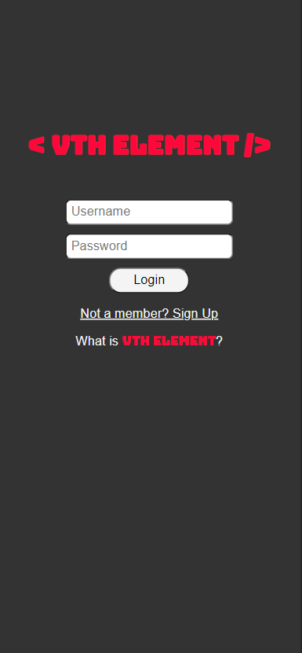
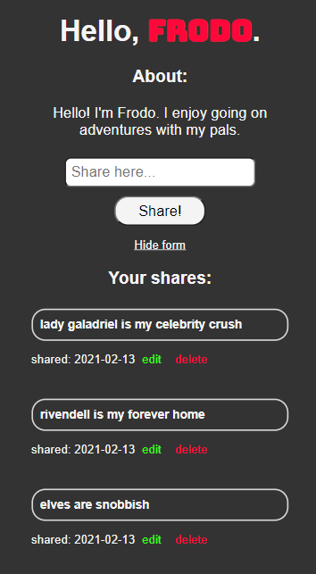
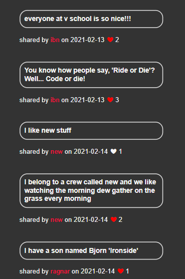

# The Vth Element

Welcome to the Vth Element! This was my last project for my coding boot camp. Currently, this is the first iteration, and I'd love to add more features and functionality to it as time goes on.

In short, you can create a profile with a username and encrypted password, add an About section, share a text-based post which you can edit or delete. You can navigate to the home page where you will see public posts by other users. You can heart or un-heart a post only once. Previously liked posts will have a red heart.

### Technologies used
- Front end:
    - React
    - JavaScript
    - HTML
    - CSS
- Back end:
    - Node & Express.js
    - MongoDB & Mongoose

### Views

This project isn't deployed, so for now you'll have to enjoy these beautiful screenshots of the login, profile, and home pages :laughing:

Login:

Profile:

Home:

